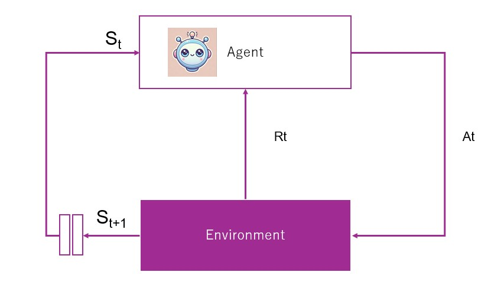

# Reinforcement Learning settings
- In Reinforcement Learning there is an Agent and there is an Environment
- Agent interacts with the Environment as described in the figure
- Agent starts from state *St*, it chooses action *At*, that forces the environment to transition to a new state *St+1* and also issue a reward of *Rt*. *t* is the time step.
- The Goal of the Agent is to maximize its **Return**. **Return** is the sum of rewards throughout the life of the Agent when it starts from a certain state *St*. **Reward** is a gain in a single time step, while **Return** is the sum of rewards across infinitely many time steps. 

# Important concepts in RL

## State transition
Every time the Agent interacts with the Environment by taking an Action
the environment transitions from one state to another.
This is represented with below notation. This notation answers the question
what is the probability of next state prime given current state s and chosen action a.

$$ 
p(s'|s,a)
$$

## Reward
Agent starts from state *s*, chooses action *a*, environnment transitions to state *s'* and agent receives a reward

$$
r(s,a,s')
$$

## Policy
What action will the Agent choose when he is at a certain state
This notation represents the probability choosing action *a*, when at state *s*

$$
\pi(a|s)
$$