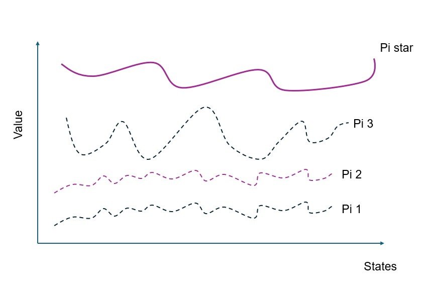
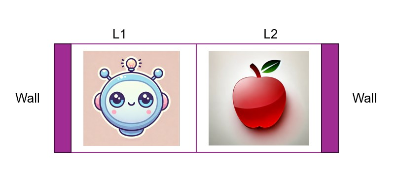
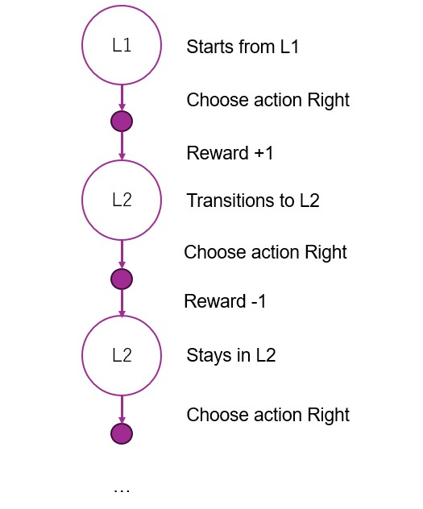
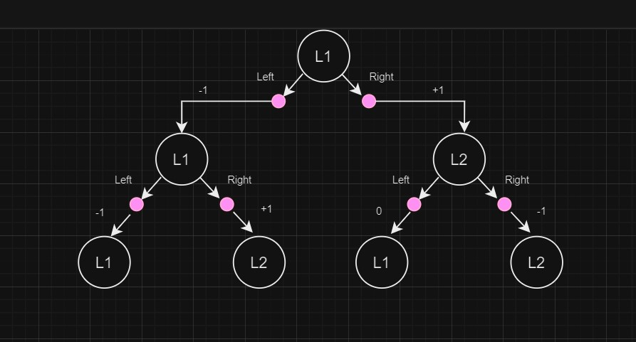

# Reinforcement Learning settings
- In Reinforcement Learning there is an Agent and there is an Environment
- Agent interacts with the Environment as described in the figure
- Agent starts from state *St*, it chooses action *At*, that forces the environment to transition to a new state *St+1* and also issue a reward of *Rt*. *t* is the time step.
- The Goal of the Agent is to maximize its **Return**. **Return** is the sum of rewards throughout the life of the Agent when it starts from a certain state *St*. **Reward** is a gain in a single time step, while **Return** is the sum of rewards across infinitely many time steps. 

# Important concepts in RL

## State transition
Every time the Agent interacts with the Environment by taking an Action
the environment transitions from one state to another.
This is represented with below notation. This notation answers the question
what is the probability of next state prime given current state s and chosen action a.

$$ 
p(s'|s,a)
$$

## Reward
Agent starts from state *s*, chooses action *a*, environnment transitions to state *s'* and agent receives a reward

$$
r(s,a,s')
$$

## Policy
What action will the Agent choose when he is at a certain state
This notation represents the probability of choosing action *a*, when at state *s*

$$
\pi(a|s)
$$

# Return
*Return* is defined as below

$$
G_t=R_t+\gamma \dot R_{t+1} + \gamma^2 \dot R_{t+2} + \gamma^3 \dot R_{t+3} + ... 
$$

Agent's goal is to find the *policy* that maximized *Return*. Policy is probabilistic,
state transitions probabilistically, reward is probabilistic, hence *Return* is also probabilistic.
Even if the Agent starts from exact same State and follows exact same Policy, the obtained *Return* may differ.
In one episode earned *Return* can be 10.4, in another it can be 9.8 etc.
To deal with such probabilistic nature of *Return* we work with its *Expected Value*
Below reads as the value of state *s* under policy *pi*.
The right side reads as the *Expected value of *Return* at time *t*, under policy *Pi* when agent starts from state *s*
$$
V_{\pi}(s) = E_{\pi}[G_t | S_t=s]
$$

We can plot **state values** under different policies *pi*.
Optimal policy *pi star* is the one where for any other *pi*

$$
v_{\pi\star} >= v_{\pi}
$$

# Markov Decision Process
We will introduce MDP, Markov Decision Process as all RL problems follow this process.
MDP is a kind of process where the Agent makes a decision based on current state only.
It doesn't take into account any other past states other than the current state.
In real life this is hardly the case, but it simplifies RL problem and allows to build Agents who can learn.

> To demonstrate why MDP is hardly the case in real life, take the example of writing text, i.e. predicting next word in a sequence.
Each word in the sequence can be considered a state.
Do you decide next word based on previous word only? Or do you take into account all previous words in the sequence?
Consider continueing below sentence. MDP says that you decide next word based on current state which is the last word in the sequence "she"
"Visiting Europe was her dream, so when she became an adult she ..."

MDP makes an assumption that *the current state* stores all the information necessary to make a decision.
In other words *the current state* encodes all the information from past states into itself.

Below is a simple example of MDP.

- This environment consists of two cells *L1* and *L2* which are surrounded by walls
- The agent can move rom one cell to another
- State transition is deterministic, i.e. if agent decides to move the *Right* then it **will move** to the *Right* and appear in the cell to the right of it
- When the agent moves from cell L1 to L2 it eats an apple and receives a reward of +1
- When it hits the walls it receives a reward of -1
- This is a never ending continuous task

**Exercise 1**
What kind of *policies* can you think of for the agent? E.g. the agent always moves to the Right.
Below is the **backup diagram** for that policy

Below is another example of back up diagram where agent chooses actions Right and Left with 50% probability

# Optimal policy for 2 cell problem
What is the optimal policy for our two cell problem?
It is known that *optimal policy* exists as deterministic policy.
Deterministic means agent will choose a particular action when at a particular state.
And deterministic policy is described as below.
Here mu is a function that produces an action *a* given a state *s*

$$
a = \mu(s)
$$

Because we have 2 cells and only 2 actions, we can have total of 4 variations of deterministic policies.

|    | L1    | L2    |
|----|-------|-------|
| mu1| Right | Right |
| mu2| Right | Left  |
| mu3| Left  | Right |
| mu4| Left  | Left  |

We can calculate values of each state under each policy.
Let's start with mu1 policy.

Remember that the value of the state is the expected value of the Return.
Return is the sum of rewards to infinity when the agent starts from that states and follows the policy.

The Return of *L1* state under policy mu1 is 

$$
V_{\mu1}(L1) = 1 + 0.9 * (-1) + 0.9^2 * (-1) + 0.9^3 * (-1) + ... = -8
$$

And the value of *L2* under policy mu1 can also be calculated

$$
V_{\mu1}(L2) = -1 + 0.9 * (-1) + 0.9^2*(-1) + 0.9^3*(-1) + ... = -10
$$

Let's calculate values of states for each policy

|      | L1   | L2   |
|------|------|------|
| Vmu1 | -8   | -10  |
| Vmu2 | 5.26 | 4.73 |
| Vmu3 | -10  | -10  |
| Vmu4 | -10  | -9   |

From above table, it is clear that mu2 is the optimal policy. 
Because under mu2 policy state values at L1 and L2 are higher than state values under any other policy.