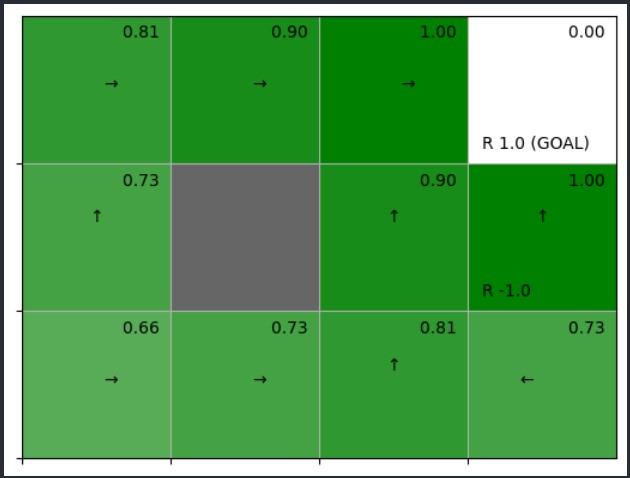

# Optimal policy derivation through Policy Iteration
How do we derive optimal policy?
On Day1 we learned that ```state values``` under optimal policy are greater than or equal to state values under any other policy.

There is actually a formula for Value function under optimal policy.

$$
V^*(s) =\max_a \sum_{s'} p(s'|s,a) * (r(s,a,s') + \gamma * V^*(s')) 
$$

Above formula tells that we choose the action where ```state value``` reaches its maximum.

We will call this ```greedification```.

Here is how the algorithm to find optimal policy works.

1. We start with a policy that randomly chooses actions.
2. We find state values under that policy.
3. We ```greedify``` our policy. Which means we will change it to choose the action that will lead the agent to the state with the maximum value. To take our grid environment as an example, every cell is a state and every cell will have a ```value```. Now, we can make 4 moves from any given cell, assuming it is surrounded by 4 cells. Each of the surrounding cells will have ```value```s. We want to move to the adjacent cell with the maximum value of all surrounding 4 cells. If that cell is the one on the top, then we will assign action ```TOP``` probability of 1.0 and we will assign all other actions probability of 0. This ```greedification``` leads to a superior policy than the current policy. Because when we calculate ```state value```s under ```greedified``` policy it always leads higher state values compared to current policy. This ```greedification``` can be expressed with below formula. Here mu of s is the deterministic function that returns an action ```a``` given a state ```s```. Essentially it says choose the action that leads to a maximum value.
$$
\mu(s) = \argmax_a \sum_{s'} * p(s'|s,a) * (r(s,a,s') + \gamma * V(s'))
$$
This is also the right place to introduce the concept of ```action value```. Action value gives us the estimate of how good a particular action is. When I start at state ```s``` and choose action ```a```, what ```value``` will I get out of it. And usually letter ```q``` is used to express action value.
$$
q(s,a) = \sum_{s'} * p(s'|s,a) * (r(s,a,s') + \gamma * V(s'))
$$
4. Now that our policy has changed, we find ```state value```s again under the new policy. And we will repeat steps 3 to 4 until our policy doesn't change anymore. At that point we will know that we converged on the optimal policy.

## Code implementation
You can run [```grid_problems/dynamic_programming/iterative_policy_improvement.py```](../../grid_problems/dynamic_programming/iterative_policy_improvement.py) to see above algorithm in action. It finds optimal policy for a more complex grid problem. In this problem our grid is a 3x4 grid. As we introduced on day2, each cell is a state and each cell has a coordinate. Top left cell starts at (0,0), as it moves horizontally second element is incremented as in (0,1), (0,2) etc., as it moves vertically first element changes, as in (1,0), (2,0) etc. Our grid environment has a ```wall``` in cell (1,1), a ```bomb``` in cell (1,3), and an ```apple``` in cell (0,3). The agent starts from cell (2,0). When the agent enters the cell with a bomb it will recieve a reward of -1, when it enters the cell with the apple it recieves a reward of +1. We define our grid game as episodic. The goal of the agent is to get to the cell with with an ```apple``` avoiding cell with the ```bomb``` and bypassing the ```wall```. When agent reaches the cell with the apple an episode ends.

As we introduced on Day2, the ```GridWorld``` class implements methods
- To get all states
- To get next state given current state and chosen action
- To get reward given current state, chosen action and transioned state
Additionally it implements methods to render ```value```s and ```action```s on the grid.

In ```iterative_policy_improvement.py``` we implemented functions to find state values for a given policy. 

We implemented ```calc_action_value``` function that calculates action values when agent starts from a state ```s``` and chooses action ```a```. This function will need ```env:GridWorld``` to find that transioned state when agenst starts from ```s``` and chooses ```a```. It will also need the environment to find the ```reward``` agent recieves. It will need ```state value```s, to calculate action value using ```reward``` and ```value``` of transioned state.

```python
def calc_action_value(env: GridWorld, v: defaultdict, state: State, action: Action, gamma: float = 0.9):
    next_state = env.next_state(state, action)
    reward = env.reward(state, action, next_state)
    return reward + gamma * v[next_state]
```

We implemented ```greedy_policy``` function to derive greedy policy from estimated ```value```s. It takes ```state value```s, then iterates over each state. For every state it calculates ```action value```s for every possible action using ```calc_action_value``` function. It sets the policy to choose the ```action``` with the highest ```value``` for a given ```state```. 

```python
def greedy_policy(v: defaultdict, env: GridWorld, gamma: float = 0.9):
    policy = defaultdict(lambda: {action: 0.0 for action in env.actions})
    for state in env.states():
        action_values = {action: calc_action_value(env, v, state, action, gamma) for action in env.actions}
        max_action_value = max(action_values.values())
        max_action = Action.TOP
        for action, action_value in action_values.items():
            if action_value == max_action_value:
                max_action = action
        action_probs = {action: 1.0 if action == max_action else 0.0 for action in env.actions}
        policy[state] = action_probs
    return policy
```

Our code then runs the iteration between ```value``` estimation and policy ```greedification``` until it converges on the optimal policy.

```python
    while True:
        v = evaluate_policy(env, v, pi, gamma, thresh)
        new_pi = greedy_policy(v, env, gamma)

        if new_pi == pi:
            break

        pi = new_pi
        cnt += 1
        print(f"Iteration {cnt} completed")
```

Below is the rendered image of the optimal policy.


# Value iteration
In above we are iterating between estimating ```state value```s under a policy, ```greedify``` policy, then again estimate ```state values``` under the new policy and so on and so forth. We could visualize this process as below


This should make you wonder, "Isn't there a shortcut to the goal of finding optimal policy?". And the answer is "Yes, there is".

Instead of jumping back and forth between policy improvement and value estimation, we can use optimal Bellman equation to converge to ```state values``` under not yet derived optimal policy. Then using Optimal ```state value```s we can construct ```greedy policy``` which is also the optimal policy. You can run [value_iteration](../../grid_problems/dynamic_programming/value_iteration_two.py) to see Value Iteration in action. The algorithm for value iteration is similar to estimating values under certain policy. But instead of summing up over actions we estimate as the maximum action value for each state using below formula

$$
V^*(s) =\max_a \sum_{s'} p(s'|s,a) * (r(s,a,s') + \gamma * V^*(s')) 
$$

Below is how we implement it in code. We first define ```value_iter_one_step``` function which updates ```state values``` one time by iterating over each ```state```.

```python
def value_iter_one_step(V: defaultdict, env: GridWorld, gamma: float = 0.9):
    for state in env.states():
        if state == env.goal_state:
            V[state] = 0
            continue
        action_values = []
        for action in env.actions:
            next_state = env.next_state(state, action)
            recieved_reward = env.reward(state, action, next_state)
            action_values.append(recieved_reward + gamma * V[next_state])
        V[state] = max(action_values)
    return V
```

Then we find optimal ```state values``` using below code

```python
V = defaultdict(lambda: 0)
while True:
    old_V = V.copy()

    V = value_iter_one_step(V, env, gamma)
    delta = max([abs(V[state] - old_V[state]) for state in env.states()])

    if delta < thresh:
        break
```

Once we converge into optimal ```state value```s, we can derive optimal policy through greedification.

```python
pi = greedy_policy(V, env, gamma)
```

That's it now we know how to derive Optimal Policy for fairly complex grid problems. Notice that in these problems we knew environment model. Specifically
- We could iterate over entire states of the environment. This is rarely the case for real world problems. Even for fairly complex games like chess or Go, states are almost infinite.
- We knew rewards for any combination of state, action, next_state. This is also rare for real world problems
- We knew state transitions for all states. Again this is rare for real world problems, because we can not know all states and all possible transitions beforehand.

In the next chapters we will solve the problem of finding Optimal Policy, when the agent doesn't know environment model beforehand. When we don't know environment model beforehand, we let the agent act in the environment, gather data and train itself to derive its optimal policy.